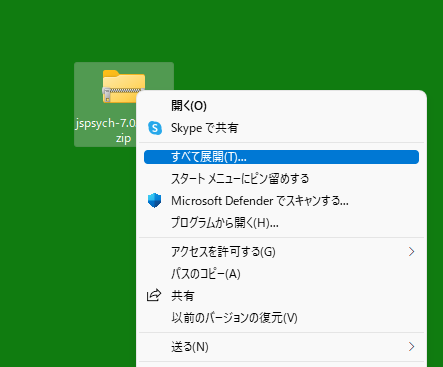
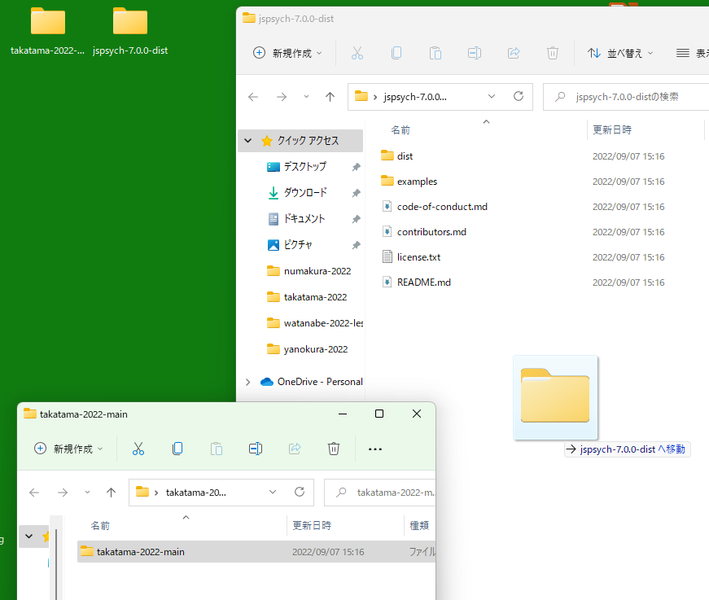
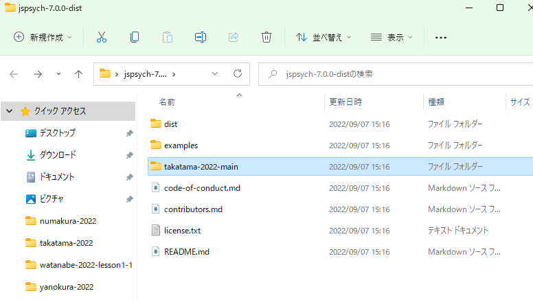
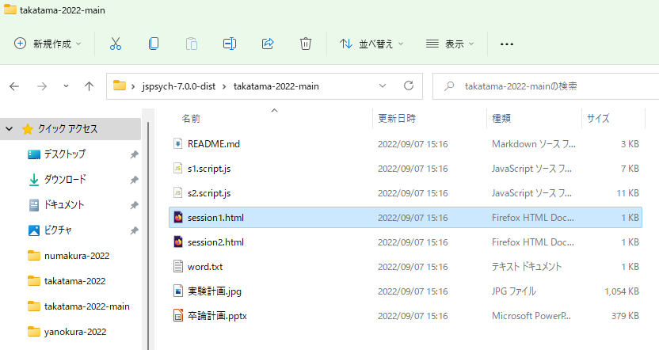

# インストール方法
  
## 1.jsPsychのダウンロード(ver7.0.0)
本家のページ  
https://github.com/jspsych/jsPsych/releases/tag/jspsych%407.0.0  
に行って、下の方にある、
「Dist archive(zip)」をクリックして jspsych-7.0.0-dist ダウンロードする。  

## 2.自分のプログラムのダウンロード
自分のレポジトリの「Code」から「Download ZIP」を選択して、ダウンロードする。
  
## 3.ダウンロードしたファイルをデスクトップにコピー
ダウンロードした jsPsych本体と、自分のプログラム を、デスクトップに置く。  
  
  
## 4.ダウンロードしたファイルの展開
ダウンロードしたファイルを、それぞれ展開する。  
  

## 5.自分のプログラムを、jsPsych フォルダに移動する。
この時に、自分のプログラムは、  
myprogram(自分のレポジトリ名、例ではtakatama-2022-main)/myprogram(自分のレポジトリ名) という構成になっているので、丸ごとではなくてmyprogramフォルダを開いた中にあるmyprogramフォルダ(ややこしい)を移動する。
  
  
こんな感じにできていればOK.  
  

## 6.プログラムの実行
自分のプログラムの入っているフォルダで、htmlファイルをダブルクリックして実験プログラムを実行する。
  
