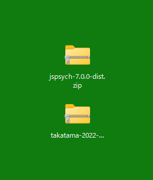

# インストール方法
  
## 1.jsPsychのダウンロード(ver7.0.0)
本家のページ  
https://github.com/jspsych/jsPsych/releases/tag/jspsych%407.0.0  
に行って、下の方にある、
「Dist archive(zip)」をクリックして jspsych-7.0.0-dist ダウンロードする。  

## 2.自分のプログラムのダウンロード
自分のレポジトリの「Code」から「Download ZIP」を選択して、ダウンロードする。
  
## 3.ダウンロードしたファイルをデスクトップにコピー
ダウンロードした jsPsych本体と、自分のプログラム を、デスクトップに置く。

## 4.ダウンロードしたファイルの展開

